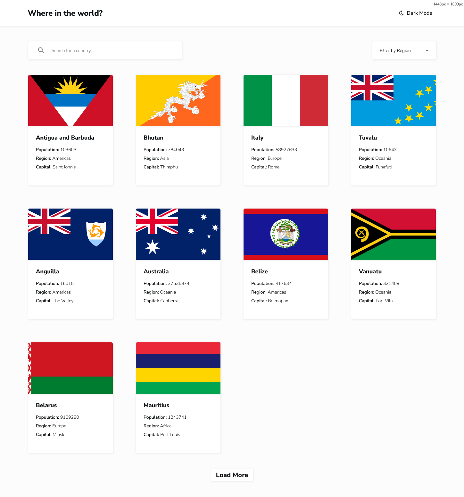
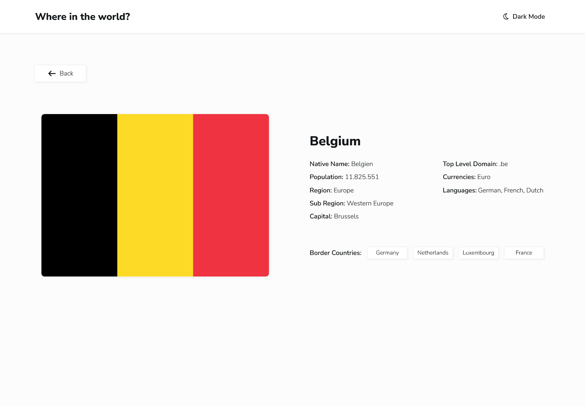

# Frontend Mentor - REST Countries API with color theme switcher solution

This is a solution to the [REST Countries API with color theme switcher challenge on Frontend Mentor](https://www.frontendmentor.io/challenges/rest-countries-api-with-color-theme-switcher-5cacc469fec04111f7b848ca). Frontend Mentor challenges help you improve your coding skills by building realistic projects.

## Table of contents

- [Overview](#overview)
  - [The challenge](#the-challenge)
  - [Screenshot](#screenshot)
  - [Links](#links)
- [My process](#my-process)
  - [Built with](#built-with)
  - [What I learned](#what-i-learned)
  - [Continued development](#continued-development)
  - [Useful resources](#useful-resources)
- [Things I added](#things-i-added)
- [Author](#author)

## Overview

### The challenge

Users should be able to:

- See all countries from the API on the homepage
- Search for a country using an `input` field
- Filter countries by region
- Click on a country to see more detailed information on a separate page
- Click through to the border countries on the detail page
- Toggle the color scheme between light and dark mode _(optional)_

### Screenshot




### Links

- Solution URL: [My solution]()
- Live Site URL: [Live site URL](https://rest-countries-api-jiah.netlify.app/countries)

## My process

### Built with

- [React](https://reactjs.org/) - JS library
- [Next.js](https://nextjs.org/) - React framework

### What I learned

Throughout this project, I learned how to fetch data from an external API and display it using React and Next.js. One important thing I discovered is that it’s cleaner and more maintainable to keep API-related logic in a separate folder (in my case, a lib folder), instead of fetching data directly inside components.

By using Next.js server components, I was able to fetch data directly in the page without relying on the useEffect hook, which is commonly used in pure React applications. Below is the function I wrote to fetch a summary of all countries:

```js
export async function fetchCountriesSummary() {
  const response = await fetch(
    "https://restcountries.com/v3.1/all?fields=cca3,flags,name,population,region,capital"
  );

  if (!response.ok) {
    throw new Error("Failed to fetch countries summary.");
  }

  const data = await response.json();
  console.log(data);
  return data;
}
```

This data is then used directly inside the CountriesPage component:

```js
const data = await fetchCountriesSummary();
```

I also learned how to create dynamic pages in Next.js using the data returned from the API. To define a dynamic route, the folder must be named using brackets, such as [slug]. Next.js then provides access to the dynamic part of the URL through the params prop.

In this project, I used the cca3 country code as the dynamic route parameter because it uniquely identifies each country. This code is then passed to an API request to fetch detailed information for a specific country:

```js
const response = await fetch(
  `https://restcountries.com/v3.1/alpha/${code}?fields=flags,name,population,region,subregion,capital,tld,currencies,languages,borders`
);
```

Here, code represents the cca3 value from the URL and is used to determine which country’s details should be displayed.

### Continued development

In the future, I want to build more projects that use external APIs to further practice and improve my skills. Working with real-world API data often requires additional logic to transform and combine information before it can be displayed correctly.

For example, when implementing the border countries feature in this project, I had to apply extra logic to retrieve and map the related country data. This is exactly the kind of problem-solving and data handling I want to continue practicing in future projects.

### Useful resources

- [WAI-ARIA basics](https://developer.mozilla.org/en-US/docs/Learn_web_development/Core/Accessibility/WAI-ARIA_basics) - This resource helped me understand how WAI-ARIA works and how to use it to make the CustomSelect component accessible.

## Things I added

### Load more button

I decided to display only 10 countries on the home page initially to improve performance. To support this, I added a “Load more” button. Each time the button is clicked, 10 more countries are displayed until there are no more countries left to show, at which point the button disappears.

This approach also improves the overall user experience by keeping the initial page load fast and the interface clean.

### Theme Switcher with System Preference

I enhanced the theme switcher so that it responds not only to user interaction but also to the system’s theme settings. When the system theme changes, the application updates automatically, providing a more seamless and user-friendly experience.

## Author

- Frontend Mentor - [@JiaHe35354](https://www.frontendmentor.io/profile/JiaHe35354)
